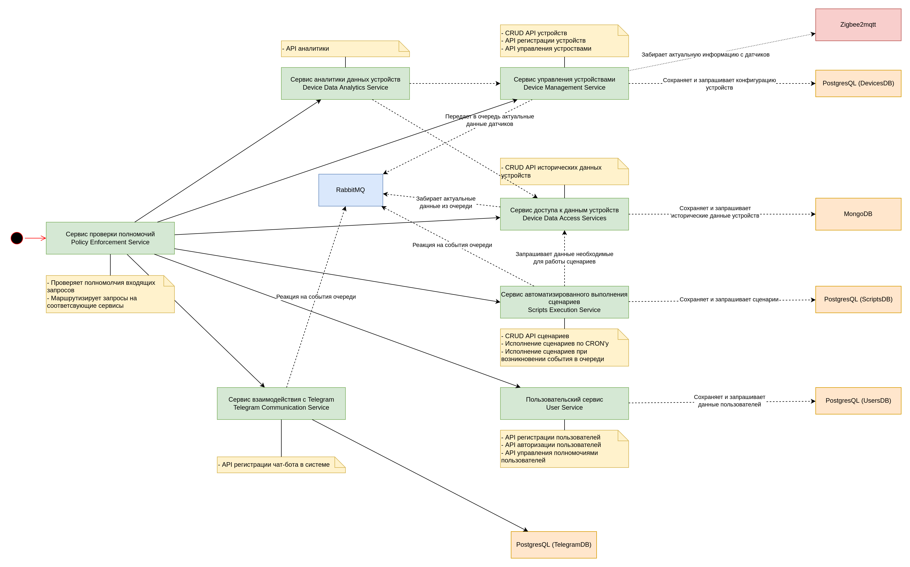

# Home Automation System

## Структура репозитория

- services - Директория содержит исходные коды сервисов системы
    - device-data-access-service - сервис доступа к данным устройств
    - device-data-analytics-service - сервис аналитики данных устройств
    - [device-management-service](/services/device-management-service) - сервис управления устройствами
    - policy-enforcement-service - сервис проверки полномочий
    - scripts-execution-service - сервис автоматизированного выполнения сценариев
    - telegram-communication-service - сервис взаимодействия с Telegram
    - user-service - пользовательский сервис

## Концепция

Система предоставляет API управления датчиками и устройствами умного дома, поддерживающих протокол Zigbee. Система использует связующее ПО - zigbee2mqtt. Zigbee2mqtt разворачивается на том же сервере, к серверу монтируется специальное устройство - zigbee-координатор, через которое происходит подключение устройств, обмен данными и командами между ПО и устройствами.

### Функции системы

- Регистрация устройств в системе
- Получение данных с устройств и их долгосрочное хранение
- Управление устройствами посредством запросов API
- Функции домашней автоматизации посредством исполнения сценарием на языке Python
- Функции аналитики данных с устройств
- Регистрация/авторизация пользователей в системе
- Отправка уведомлений в Telegram
- Отправка команд устройствам через чат-бота Telegram
- Управление полномочиями пользователей

### Возможные сценарии использования системы

1) В системе зарегистрированы умные лампочки, пользователь может управлять ими через чат-бот
2) В системе зарегистрирован датчик протечки, в случае протечки пользователю отправляется уведомление
3) В системе зарегистрировано умное реле и датчик климата, реле подключено к вытяжке на кухне, датчик расположен рядом с вытяжкой. Если температура поднимается выше заданной - система включает вытяжку

### Состав сервисов системы

- Сервис проверки полномочий (Policy Enforcement Service) - Является точкой входа в приложение, принимает все входящие запросы, проверяет права доступа к запрашиваемому ресурсу и маршрутизирует на него
- Пользовательский сервис (User Service) - Предоставляет API для регистрации и авторизации пользователей, для управления полномочиями пользователей
- Сервис управления устройствами (Device Management Service) - Предоставляет API для регистрации устройств в системе, API для работы с ними
- Сервис доступа к данным устройств (Device Data Access Services) - Предоставляет API для добавления и получения исторических данных с устройств
- Сервис автоматизированного выполнения сценариев (Scripts Execution Service) - Предоставляет API для управления сценариями автоматизации
- Сервис аналитики данных устройств (Device Data Analytics Service) - Предоставляет API для проведения базовой аналитики над данными с устройст
- Сервис взаимодействия с Telegram (Telegram Communication Service) - Предоставляет API для управления чат-ботами

### Подсистема хранения данных
- PostgreSQL
- MongoDB

### Другие компоненты
- RabbitMQ
- Zigbee2MQTT

### Полномочия системы:
- Администратор
- Пользователь

### Ресурсы
- https://ru.wikipedia.org/wiki/Zigbee
- https://www.zigbee2mqtt.io/
- https://ru.wikipedia.org/wiki/%D0%94%D0%BE%D0%BC%D0%B0%D1%88%D0%BD%D1%8F%D1%8F_%D0%B0%D0%B2%D1%82%D0%BE%D0%BC%D0%B0%D1%82%D0%B8%D0%B7%D0%B0%D1%86%D0%B8%D1%8F

## Архитектура

## [Развертывание](/deploy)

